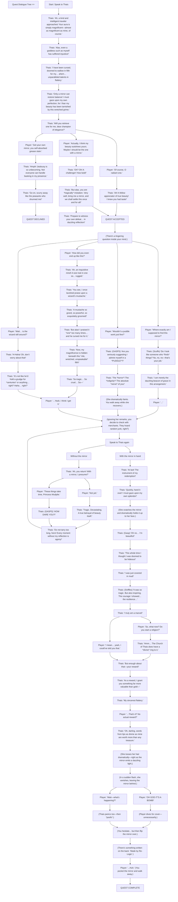

```mermaid
flowchart TD
  0[Quest Dialogue Tree >>]

  %% --- INITIAL QUEST DIALOGUE --- %%
  A[Start: Speak to Thais] --> B["Thais: 'Ah, a kind and intelligent traveler approaches! Your aura is simply magnificent—almost as magnificent as mine, of course.'"]
  B --> C["Thais: 'Alas, even a goddess such as myself has suffered injustice!'"]
  C --> D["Thais: 'I have been cursed, doomed to wallow in filth for my… ahem… unparalleled talents in flattery.'"]
  D --> E["Thais: 'Only a mirror can restore balance! I must gaze upon my own perfection, for I fear my beauty has been tarnished by this wretched grime.'"]
  E --> F["Thais: 'Will you retrieve one for me, dear champion of elegance?'"]

  %% --- ACCEPT OR DECLINE QUEST --- %%
  F --> G["Player: 'Of course, O radiant one.'"] 
  F --> H["Player: 'Get your own mirror, you self-absorbed grease stain.'"]
  F --> I["Player: 'Actually, I think my beauty outshines yours. Maybe I should be the one with a mirror.'"]

  G --> J["Thais: 'Ah! A fellow appreciator of true beauty! I knew you had taste!'"]
  H --> K["Thais: 'Hmph! Jealousy is so unbecoming. Not everyone can handle basking in my presence.'"]
  K --> L["Thais: 'Go on, scurry away like the peasants who shunned me!'"]
  L --> M[QUEST DECLINED]

  I --> N["Thais: 'Oh? Oh! A challenger! How bold!'"]
  N --> O["Thais: 'But alas, you are *tragically* mistaken. Very well, bring me a mirror, and we shall settle this once and for all!'"]
  O --> P["Thais: 'Prepare to witness your own defeat… in dazzling reflection!'"]
  
  J --> Q["QUEST ACCEPTED"]
  O --> Q

  %% --- ASKING ABOUT THE MIRROR --- %%
  Q --> R["(There's a lingering question inside your mind.)"]
  R --> S["Player: 'Where exactly am I supposed to find this mirror?'"]
  R --> T["Player: 'Wouldn’t a puddle work just fine?'"]

  S --> U["Thais: (Scoffs) 'Do I look like someone who *finds* things? No, no, no—that’s your job.'"]
  U --> V["Thais: 'I am merely the dazzling beacon of grace in this arrangement.'"]
  V --> W["Player: '...'"]
  W --> X["(Ignoring her remarks, you decide to check with merchants. They hoard random junk, right?)"]

  T --> Y["Thais: (GASPS) 'Are you seriously suggesting I admire myself in a *PUDDLE*?!'"]
  Y --> Z["Thais: 'The *horror*! The *indignity*! The absolute *nerve* of you!'"]
  Z --> AA["(She dramatically faints. You walk away while she recovers.)"]
  AA --> X

  %% --- ASKING ABOUT HER CURSE --- %%
  R --> AB["Player: 'How did you even end up like this?'"]
  R --> AC["Player: 'Wait… is the wizard still around?'"]

  AB --> AD["Thais: 'Ah, an inquisitive mind! A rare trait in one so... rugged.'"]
  AD --> AE["Thais: 'You see, I once lavished praise upon a wizard’s mustache.'"]
  AE --> AF["Thais: 'A mustache so grand, so powerful, so exquisitely groomed!'"]
  AF --> AG["Thais: 'But alas! I praised it *one* too many times… and he cursed me for it.'"]
  AG --> AH["Thais: 'Now, my magnificence is hidden beneath this *vile, wretched, unspeakable* filth!'"]
  AH --> AI["Thais: 'So tragic… So cruel… So—'"]
  AI --> AJ["Player: '...Yeah, I think I get it.'"]
  AJ --> X

  AC --> AK["Thais: 'H-Haha! Oh, don’t worry about that!'"]
  AK --> AL["Thais: 'It’s not like he’d hold a grudge for *centuries* or anything… right? Haha… right?'"]
  AL --> AJ

  %% --- RETURNING TO THAIS --- %%
  X --> AM["Speak to Thais again"]
  AM --> AN["Without the mirror"]
  AM --> AO["With the mirror in hand"]

  %% --- WITHOUT THE MIRROR --- %%
  AN --> AP["Thais: 'Ah, you return! With a mirror, I presume?'"]
  AP --> AQ["Player: 'Not yet.'"]
  AP --> AR["Player: 'These things take time, Princess Mudpile.'"]

  AQ --> AS["Thais: 'Tragic. Devastating. A true betrayal of beauty itself.'"]
  AR --> AT["Thais: (GASPS) 'HOW DARE YOU?!'"]
  AS --> AU["Thais: 'Do not tarry too long, hero! Every moment without my reflection is agony!'"]
  AT --> AU

  AU --> X

  %% --- WITH THE MIRROR --- %%
  AO --> AV["Thais: 'At last! The instrument of my redemption!'"]
  AV --> AW["Thais: 'Quickly, hand it over! I must gaze upon my own splendor!'"]
  AW --> AX["(She snatches the mirror and dramatically holds it up to her face.)"]

  %% --- REACTION TO HER REFLECTION --- %%
  AX --> AY["Thais: (Gasp) 'Oh no… I’m beautiful!'"]
  AY --> AZ["Thais: 'This whole time I thought I was doomed to be hideous!'"]
  AZ --> BA["Thais: 'I was just covered in mud!'"]
  BA --> BB["Thais: (Sniffles) 'It was so tragic. But also inspiring. The courage I showed… the resilience…'"]
  BB --> BC["Thais: 'I truly am a marvel!'"]

  BC --> BD["Player: 'I mean… yeah, I could’ve told you that.'"]
  BC --> BE["Player: 'So, what now? Do you start a religion?'"]

  BE --> BF["Thais: 'Hmm… The Church of Thais does have a *divine* ring to it.'"]
  BF --> BG["Thais: 'But enough about that—your reward!'"]
  BD --> BG

  %% --- THE REWARD (SORT OF) --- %%
  BG --> BH["Thais: 'As a reward, I grant you something far more valuable than gold—'"]
  BH --> BI["Thais: 'My sincerest flattery.'"]

  BI --> BJ["Player: '...That's it? No actual reward?'"]
  BJ --> BK["Thais: 'Oh, darling, words from lips as divine as mine are worth more than any treasure.'"]
  BK --> BL["(She tosses her hair dramatically—right as the mirror emits a dazzling light.)"]
  BL --> BM["(In a sudden flash, she vanishes, leaving the mirror behind.)"]

  %% --- FINAL PLAYER REACTION --- %%
  BM --> BN["Player: 'Wait—what’s happening?!'"]
  BM --> BO["Player: 'OH GOD IT’S A BOMB!'"]

  BO --> BP["(Player dives for cover—unnecessarily.)"]
  BN --> BQ["(Thais panics too—then *poofs*.)"]

  BP --> BR["(You hesitate... but then flip the mirror over.)"]
  BQ --> BR

  BR --> BS["(There's something written on the back: 'Made by Re-Logic'.)"]
  BS --> BT["Player: '...Huh.' (You pocket the mirror and walk away.)"]
  BT --> BU[QUEST COMPLETE]
```
